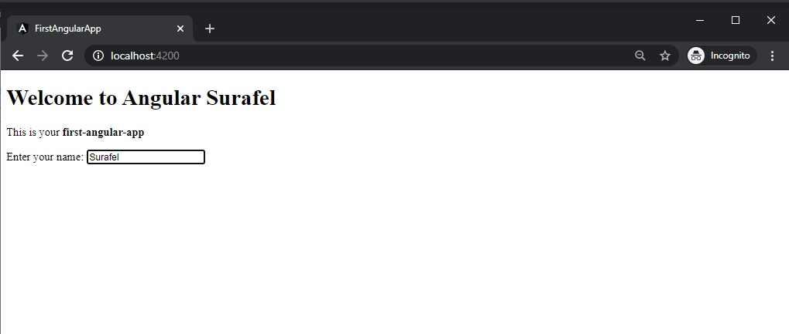

# First Angular App



Run the app, after installing the dependencies, using

```npm
    ng serve
```

## What I did?

Replaced the `app/files`

1. `app.component.html`
   
```js
    <h1>Welcome to Angular {{ name }}</h1>
    <p> This is your <b>{{title}}</b></p>
    Enter your name: <input type="text" [(ngModel)] = "name">
```

2. `app.component.ts`

```js 

    import { Component } from '@angular/core';

    @Component({
    selector: 'app-root',
    templateUrl: './app.component.html',
    styleUrls: ['./app.component.css']
    })
    export class AppComponent {
    name = '';
    title='first-angular-app'
    }


```


1. `app.module.ts`

```js

    import { BrowserModule } from '@angular/platform-browser';
    import { NgModule } from '@angular/core';
    import { FormsModule } from '@angular/forms';
    import { AppComponent } from './app.component';

    @NgModule({
    declarations: [
        AppComponent
    ],
    imports: [
        BrowserModule,
        FormsModule
    ],
    providers: [],
    bootstrap: [AppComponent]
    })
    export class AppModule { }

```